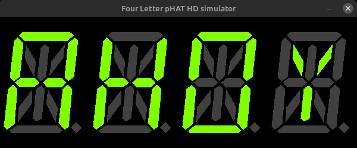

# Four Letter pHAT Simulator

A Tk based server to simulate Four Letter pHAT on your Windows, Linux or macOS PC.



Works by hijacking the `smbus` module imported by `fourletterphat` and replacing it with a FIFO pipe to the Tk based simulator.

## Usage

Set the `PYTHONPATH` variable to the simulator directory and run an example. The fake `smbus` will be loaded instead of the real one and output will launch in a new window:

```
PYTHONPATH=simulator python3 examples/clock.py
```
